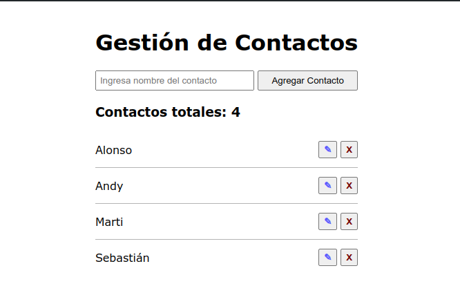
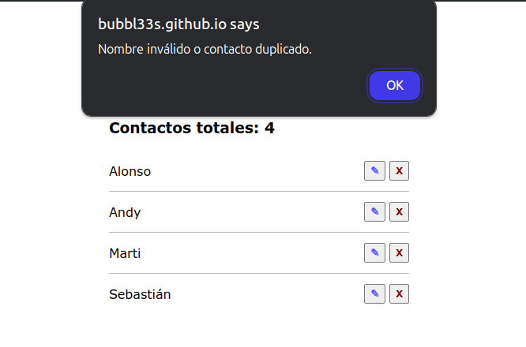

# Make It Real - GESTIÓN DE CONTACTOS

This is a solution to the work in pairs '**Gestión de Contactos**' project of the Make It Real course.

## Table of contents

- [Overview](#overview)
  - [The challenge](#the-challenge)
- [Actual result](#actual-result)
- [My process](#my-process)
  - [Built with](#built-with)
- [Author](#author)
- [Acknowledgments](#acknowledgments)

## Overview

### The challenge

Su desafío es desarrollar una app de gestión de contactos usando JavaScript Vanilla con los siguientes requerimientos

1. Estructura HTML inicial:

   - Un formulario con los siguientes campos:
     - Campo de texto para ingresar el nombre del contacto.
     - Botón para agregar el contacto.
   - Una lista vacía donde se mostrarán los contactos creados.

1. Funcionalidades que debe tener la aplicación:

   1. Agregar Contactos:

      - Cuando el usuario ingrese un nombre en el campo de texto y haga clic en el botón "Agregar", el contacto debe aparecer en la lista.

      - Cada contacto en la lista debe tener un botón para Editar y un botón para Eliminar.

   1. Eliminar Contactos:

      - Al hacer clic en el botón "Eliminar" junto a un contacto, este debe eliminarse de la lista.

   1. Editar Contactos:
      - Al hacer clic en el botón "Editar", el nombre del contacto debe volverse editable. Al hacer clic en un botón de "Guardar" (que debe reemplazar al de "Editar"), el contacto debe actualizarse en la lista con el nuevo nombre.

1. Manejo del DOM:
   - Usa JavaScript para crear, modificar y eliminar elementos de la lista de contactos (por ejemplo, document.createElement(), appendChild(), removeChild()).
1. Manejo de Eventos:
   - Usa event listeners (addEventListener) para agregar interactividad a los botones de "Agregar", "Eliminar", y "Editar".
1. Validación:
   - Asegúrate de que el campo de texto no esté vacío antes de agregar un contacto.
   - Evita duplicados en la lista de contactos.

## Actual Result

### Deploy

**[Go to site](https://bubbl33s.github.io/agenda-contactos-js-vanilla/)** ↗️

## My process

### Built with

- HTML
- CSS
- Vanilla JavaScript

## Author

Valeria Lozano _a.k.a._ **Bubbl33s**

- [GitHub](https://www.your-site.com)
- [Codepen](https://codepen.io/Bubbl33s)

Bryam Aranguri
- [GitHub](https://github.com/bryamaranguri)

## Acknowledgments

- Make it Real mentors
